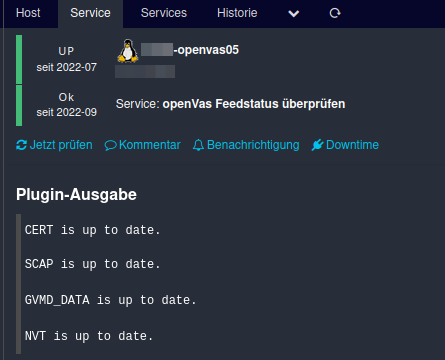

</img>
<h1 align="center">Icinga2 Scripts</h1>
<h3 align="center">check_openvas_feed_status</h3>

  

 
<h3 align="center">
    <a href="https://github.com/n1tr0-5urf3r/check_openvas_feed_status/releases/">Download Latest
    </a>・
    <a href="https://exchange.icinga.com/n1tr0-5urf3r">Other Projects</a>・<a href="https://www.paypal.com/donate/?hosted_button_id=KXMYX49C6MLLN">Donate</a></h3>

---

## check_feed_status
This plugin checks if Greenbone OpenVAS feeds are still up to date. If they are older than 10 days, a warning is displayed.
### Installation
Following entries in visudo are required:

        nagios ALL=(gvm:gvm) NOPASSWD: /opt/gvm/sbin/greenbone-feed-sync --feedversion --type *
        nagios ALL=(gvm:gvm) NOPASSWD: /opt/gvm/bin/greenbone-nvt-sync --feedversion

Where `gvm` is the user openVAS runs as. Adapt paths accordingly

### Usage    
Simply invoke with `./check_feed_status`

---

## Donation
If you like my work a donation is very welcome :) 

